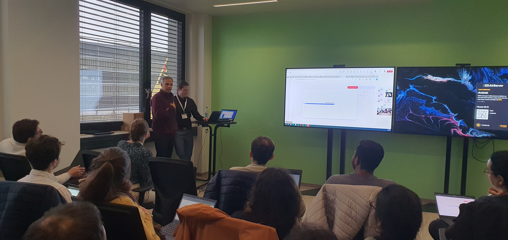
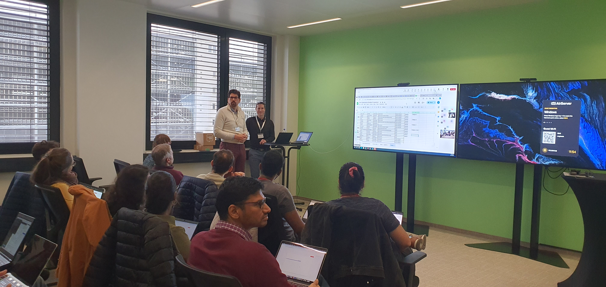
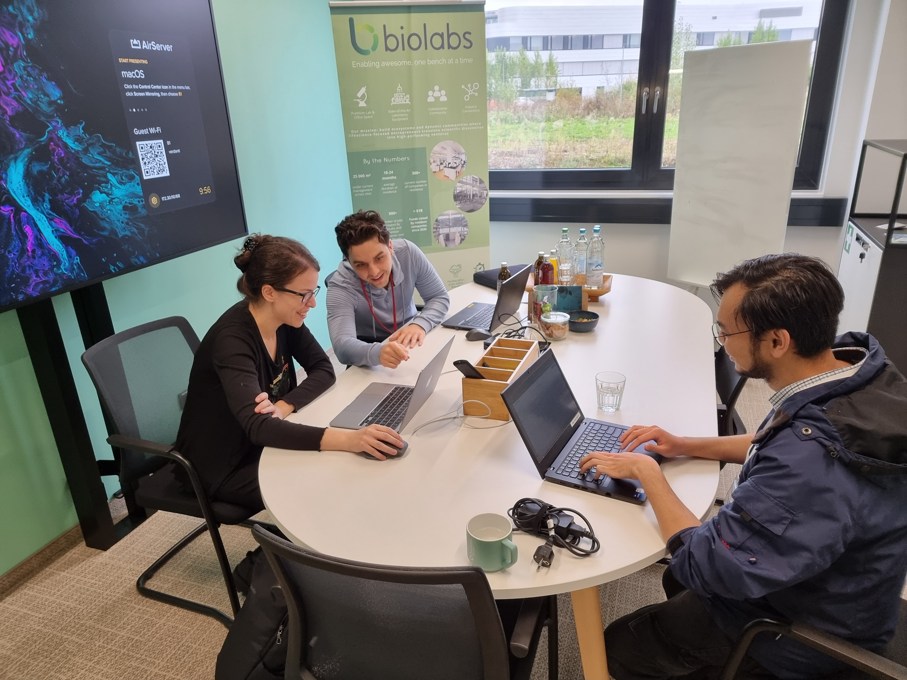
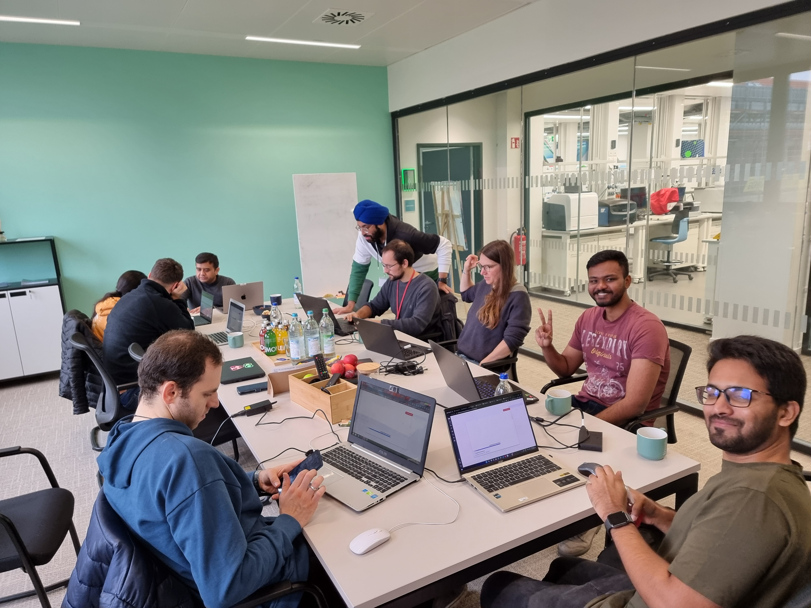
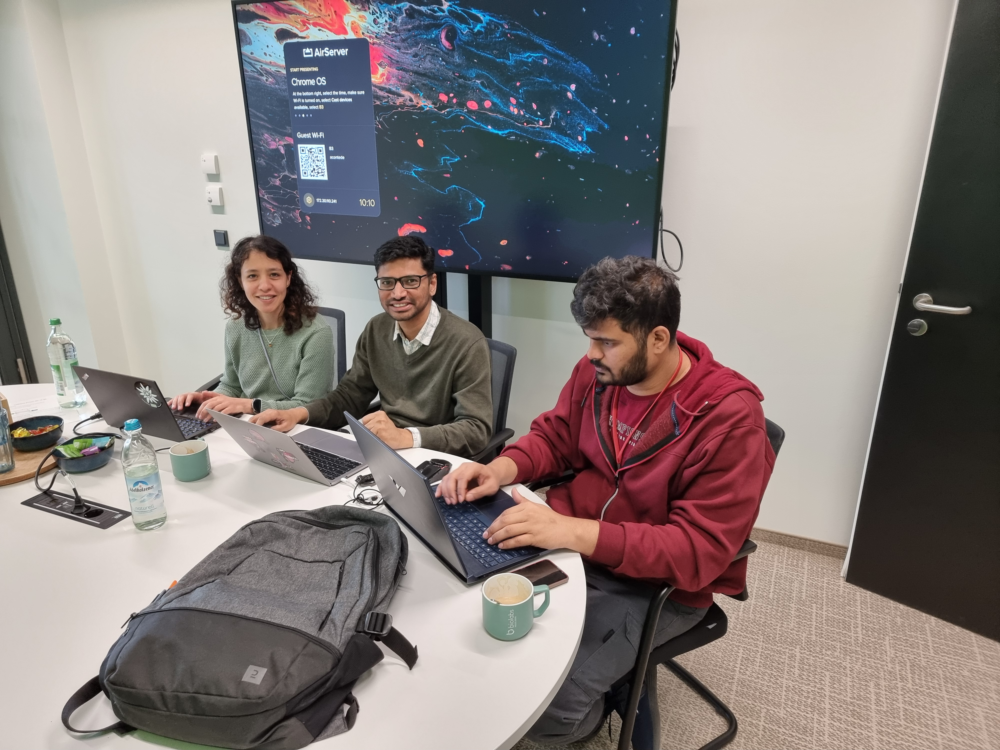
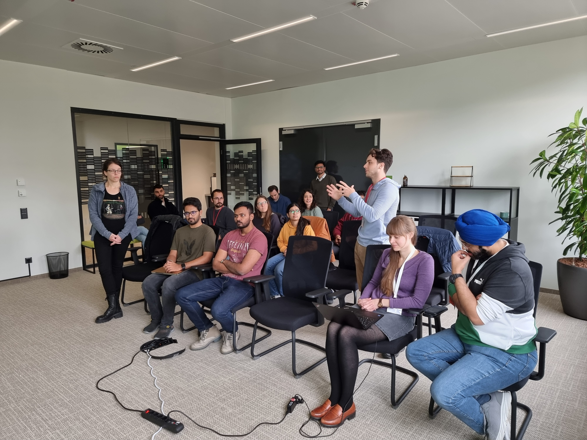
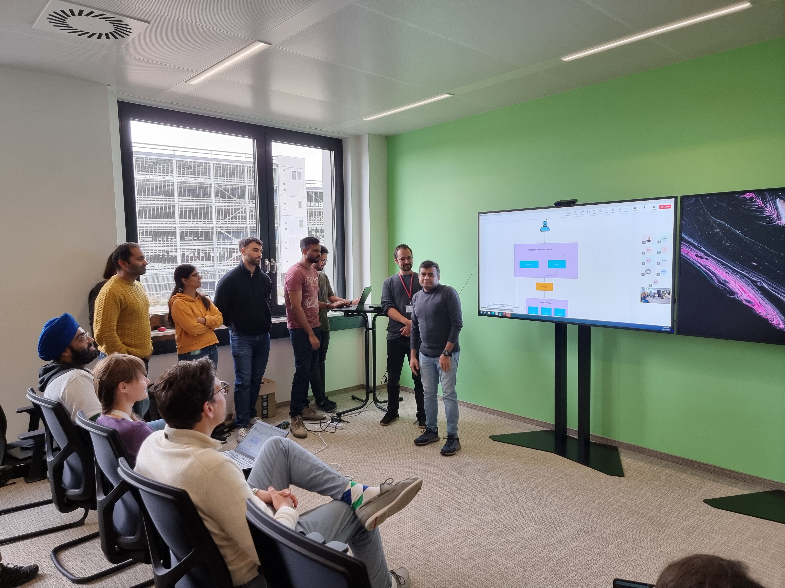

---
hide:
  - navigation
  - toc
---

# Results for AI agents for life sciences

> 🎉 
> 3 AI Agents for Life Science applications were hacked by 7 teams during our past Hackathon in collaboration with Code Ocean, BioLabs Heidelberg, and Sanofi 
> 🎉 

## The challenge
Create an AI Agent to

1. simulate and ask questions of computational models of disease, 
2. process, analyse, and chat with single cell sequencing data, and 
3. query and talk to biomedical Knowledge Graphs

𝒖𝒔𝒊𝒏𝒈 𝒐𝒏𝒍𝒚 𝒇𝒓𝒆𝒆 𝒇𝒐𝒓𝒎 𝒕𝒆𝒙𝒕 𝒊𝒏𝒑𝒖𝒕𝒔!

## The result
🎖️ 1 OpenSource multi-AI-agent workflow starter kit including code, cloud-native virtual environment, and example data assets was created using Code Ocean and ran on Amazon Web Services (AWS) to kick-start the hackathon.  
🎖️ 7 teams (21 participants) bravely undertook the immense challenge requiring both technical skill and biomedical knowledge over two days on October 14 to 15. 
🎖️ 3 AI Agents that can add value to Drug Discovery, Drug Development, Biotechnology, and Pharmaceutical research were hacked together and demoed in front of industry judges. 

## Shout out to the people who made it happen
⭐Our coaches and judges Lilija Wehling, Ahmad Wisnu Mulyadi, and Gurdeep Singh from TeamVPE at BioMed X Institute, Henrik Cordes, Tommaso Andreani, Ph.D. from Sanofi, and Dr. Christoph Geiger from CodeOcean. 
⭐ Technical wizardry from Shahar Frumkin, Jake Valsamis, Conor Mohan, PhD, Dror Hilman, Ben Even Tsur, Daniel Koster, and Simon Adar from Code Ocean who among many MANY things came to the rescue with additional AWS resources and licenses when we hit our limit during the Hackathon.  
⭐ Our support team Merve P., Flavia-Bianca Cristian, Mallory Grahnert, Swathi Lingam, Sofija Prikule, Benjamin Raeder, Thomas Rueckle, and Christian Tidona from BioMed X Institute X. 
⭐ The Cadillac of hackathon venues at BioLabs Heidelberg and amazing hosts Ornella Kossi, Ann-Kristin Mueller, and Stefanie Schimmel 
⭐ Our courageous and motivated participants from DKFZ German Cancer Research Center, Heidelberg University, University of Cologne, Karlsruhe Institute of Technology (KIT), Goethe University Frankfurt, SRH Hochschule Heidelberg, and abroad who participated in person and online. 

## Photos

